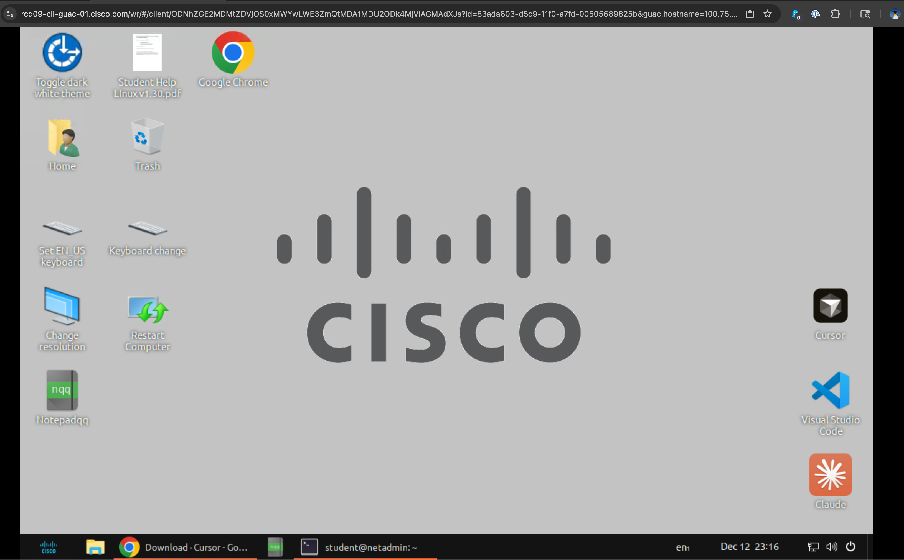
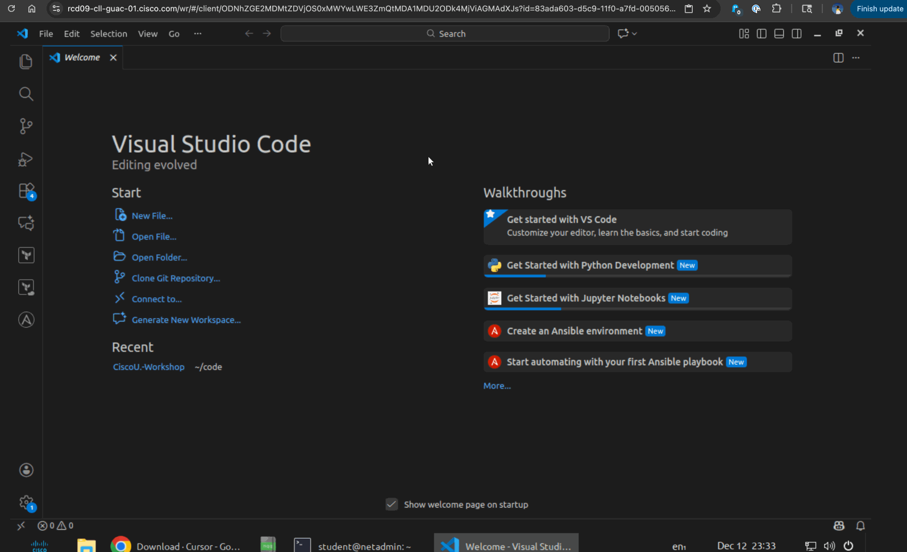

# Python Hands-on


## Introduction

This Lab introduces learners to the practical use of Python for network automation through the exploration of variables, lists, dictionaries, loops, Python libraries, the Python interactive shell, conditionals, functions, and virtual environments. The goal is to help network engineers bridge the gap between manual operations and programmatic control, making everyday workflows more efficient and scalable.

This Lab is part of the NetAcad Workshop series.

## What You'll Learn

- How to utilize the Python interactive shell
- How to print information to output
- How to assign values to variables and display them
- The different types of Python data structures and how to parse/iterate through them using control structures
- Python conditional statements
- Defining Python functions
- How to import Python libraries into a larger script

## What You'll Need

- A client computer
- Internet access to the Cisco Modeling Labs topology and Ubuntu jumphost

> Note: All development will be done on the Ubuntu jumphost within the student pod.  Connections to the routers will be made via external breakouts within the topology.

## Lab Steps

### Step 0: Familiarizing Yourself with the Remote Access Environment

1. Access your web remote desktop session by following the link provided by the proctors.  This will launch a desktop environment within your browser (Chrome preferred).

    

2. This is an Ubuntu workstation, configured with several of the tools that we will be using throughout the lab.  For this exercise, we will be using VSCode.  Launch VSCode by double-clicking on the desktop icon.

3. When VSCode launches, you will be presented with the Welcome Screen.  Click on the `Files` icon on the top of the left-hand sidebar, then select `Open Folder`.  Navigate to `~/code/CiscoU.-Workshop/` and click **Open**.  This will display a folder structure of all files within the workshop.

    

4. Everything within the web browser will function as a normal Ubuntu computer, and you have access to all of the tools that are installed.  To copy and paste between 

### Step 1: Python Hello World

In software development, it is a fun custom to begin each project with a **Hello, World!**

1. Access the Ubuntu jumphost via web browser

2. In the menu at the top of the screen click `View`.  When the menu appears, click `Terminal` to open a new terminal window at the bottom of the screen.

3. In the Terminal window, enter the Python interactive shell by typing `python -i` and pressing `Enter`.

    > The Python interpreter provides the Python interactive shell, which operates much in the way that a Unix/Linux shell operates. It takes in data, processes that data, and returns outputs.  There are two distinct ways to operate with the interpreter:
    > - Through a script
    > - Through the interactive mode, at the command line (as we are doing now)

4. Type `print("Hello, World!")` in the Python interactive shell and press `Enter`.

    > The `print()` function returns the output to the screen so that it can be consumed by the user.
    > The print function has a vast set of functionality - documentation on all the different features can be found [at this link](https://docs.python.org/3/tutorial/inputoutput.html).

5. Type `exit()` and press `Enter` to exit the Python interactive shell.

6. In the panel (on the left of the screen):
    - Click on the Explorer (files icon).
    - Click on the `Open Folder` button
    - Select the `~/code/CiscoU.-Workshop/` folder
    - Open the directory for this section (`day2/06-hands-on-intro-python`) and right-click on the `code` folder, which is where you will create your Python script.
    - Choose `New File` from the context menu.
    - Type `hello.py` to name your file, and press `Enter`.

7. The `hello.py` file should open automatically, but you can also open it by clicking on it in the Explorer on the left.

8. In the `hello.py` file, type `print("Hello, World!")` and save it by returning to the Menu on the left and selecting `File > Save` or by using the keyboard shortcut.

9. Run your Python script by typing `python hello.py` in the Terminal and pressing `Enter`.

    > Not working? Make sure, in the Terminal, that you are executing this command within the same directory as the `hello.py` script: the `code` directory of the Python Hands-on Lab. Just because you've opened a certain directory in Explorer does not mean the Terminal is oriented to that directory as well.

    - You can determine your location in the file system by typing the `pwd` (print working directory) command.
    - The `ls` command is used to list files and directories within the current working directory.
    - The `cd` (change directory) command is used to navigate between directories in a filesystem—either into subdirectories or up to parent directories, or across to sibling or absolute paths.

    > A typical command sequence to determine where you are (current directory), determine what's located within your current directory, and move directories would be something like:
    > `pwd` ->`ls` -> `cd code`

### Step 2: Instantiating and Printing Variables

In Python, variables that are defined and initialized within a file or the Python interactive shell can later be accessed and reassigned within the same environment.

1. In the Terminal, re-enter the Python interactive shell by typing `python -i` and pressing `Enter`.

2. Create a variable `family` and assign it the string value `"MS"`.

    ```python
    family = "MS"
    ```

3. Create an integer variable `model` and assign it the value `220`.

    > Hint: no quotation marks are needed.  Additionally, Python does not require you to declare the data type of a variable before assigning it a value.

    ```python
    model = 220
    ```

4. Create a boolean variable `interface_enabled` and assign it the value `True`.

    > Hint: once again, no quotation marks needed.  Additionally, Python does not require you to declare the data type of a variable before assigning it a value.

5. Enter the following into the Python interactive shell to print the variables to the screen.

    ```python
    print(family)
    print(model)
    print(interface_enabled)

    print(family, model, interface_enabled)
    ```

    > Note: After a multiline statement, such as the print statements above, the Python interactive shell may require you to press `ENTER` multiple times to execute all the lines.

    Expected output:

    ```python
    MS
    220
    True
    MS 220 True
    ```

6. To print a string containing variables, Python offers a useful formatting method called f-strings.
To create an f-string, use the prefix f and include variables inside curly brackets, for example:

    ```python
    print(f"Switch {family} {model} interface is enabled: {interface_enabled}")
    ```

    > Note: f-strings require Python 3.6 or later.

### Step 3: Working with Python Lists

Python **lists** are used to store collections of data. This is similar to the concept of an array in data science and some other programming languages. A Python list can contain elements of different data types—a list can even contain other lists. The data in a list is accessed through its **index**.

#### Using Lists

You create a list by using square braces/brackets `[ ]` and separating the elements of the list with commas.

```python
lookup = ["ssh", "tcp", "ftp", 19.2, 20.1]
```

To access elements in the list, use the element's index. Note that indexes start at 0.

```python
>>> lookup = ["ssh", "tcp", "ftp", 19.2, 20.1]
>>> print(lookup[1])
tcp
```

To append items to a list, use the `.append()` method.

```python
>>> lookup.append(9200)
>>> print(lookup)
['ssh', 'tcp', 'ftp', 19.2, 20.1, 9200]
```

1. In the terminal, activate the Python interpreter by typing `python -i` (if you are not already there) and create a list `my_interfaces` with interface names.

    ```python
    my_interfaces = ["GigabitEthernet 1", "GigabitEthernet 2", "GigabitEthernet 3"]
    ```

2. Append another item to the `my_interfaces` list.

    ```python
    my_interfaces.append([24, True, "Default gateway"])
    ```

3. Print out the list and investigate the structure.

    ```python
    print(my_interfaces)
    ```

    Expected output: a Python list that contains a combination of strings and one **nested** list as one of its elements.

    ```python
    ['GigabitEthernet 1', 'GigabitEthernet 2', 'GigabitEthernet 3', [24, True, 'Default gateway']]
    ```

4. How can you access and print just the value "Default gateway" from the `my_interfaces` list?

    > **Hint:** If you have nested data, you define the indexes one after another while going deeper into the structure!

- Fill-in the blank for the command to return the value "Default gateway".

    ```python
    print(my_interfaces[3][_])
    ```

<details>
<summary>Click for the answer.</summary>
<br>print(my_interfaces[3][2])
</details>

### Step 4: Working with Python Dictionaries

A **dictionary** is a data structure that stores simple key-value pairs. While with lists you accessed data through the index *number*, with dictionaries you access data through the index *key*.

#### Using Dictionaries

- **Values**: The values in a Python dictionary can be of any data type, and like lists, the types don't have to be consistent.
- **Keys**: Most often you will find **strings** used as keys, but you might also run into **integers** being used as keys. A dictionary's keys have an important restriction: whatever you want to use as a key has to be immutable and hashable.

  - Immutable: Keys must be of a type that cannot change once created (for example: strings, numbers, tuples).
  - Hashable: Keys must be able to produce a unique hash value so that Python can efficiently look them up in the dictionary. This is typically the case for immutable types.

You create a dictionary by using curly braces `{ }`, separating a key from its value with a colon `:`, and separating the key-value pairs with commas `,`.

```python
device_host = {"ipv4address": "192.168.0.10", "traffic": "inbound", "port": 40044}
```

As with lists, for Python dictionaries you access and update elements using indexing. However, instead of using numerical sequential index numbers, you use the key as the index.

```python
device_host["traffic"]
```

You can add new elements simply by assigning a value to a new key.

```python
device_host["alert"] = "Never"
```

1. Continue working in the Python interactive shell, creating a dictionary for `device_details`.

    ```bash
    device_details = {"hostname": "sw1", "sw_version": 20.4, "alerts": False}
    ```

2. How would you print out the hostname of the device?

    ```python
    print(device_details["hostname"])
    ```

    Expected output:

    ```python
    sw1
    ```

3. Add a new key `"interfaces"` to the device_details and save the `my_interfaces` list you created earlier into it.

    ```python
    device_details["interfaces"] = my_interfaces
    ```

4. Print out the `device_details` and investigate the structure.

    ```python
    print(device_details)
    ```

    Expected output: a Python dictionary with mixed data types for values—including including a list nested within a list.

    ```python
    {'hostname': 'sw1', 'sw_version': 20.4, 'alerts': False, 'interfaces': ['GigabitEthernet 1', 'GigabitEthernet 2', 'GigabitEthernet 3', [24, True, 'Default gateway']]}
    ```

5. How can you print just the value `"Default gateway"` from within this dictionary?

    > **Hint:** You must define the full path of indexes! Remember when you were working with a list and needed the "Default gateway"?

    ```python
    print(my_interfaces[3][2])
    ```

    > Adjust the above snippet to include the "device_details" dictionary name and the "interfaces" key, along with the "[3][2]" to specify the "Default Gateway".

    <details>
    <summary>Click for the answer.</summary>
    <br>print(device_details["interfaces"][3][2])
    </details>
    <br>

### Step 5: Python script structure

Python has (nearly) no firm requirements on how to structure your scripts/programs. Therefore, you have flexibility in the way your code ultimately looks and operates. However, there are Python standard recommendations in place to ensure that best practices are followed.

> Check out the [PEP8](https://peps.python.org/pep-0008/) style guide!

The *only* firm requirement for execution and structure is **indentation**. In Python, indentation isn't just a matter of style—it's a syntactic requirement. The Python interpreter uses indentation to define blocks of code and how those blocks are executed.

Indentation is achieved using whitespace (tabs or spaces) at the beginning of each line. You can choose to use either tabs or spaces—you must choose between them and remain consistent within a project. In other words, no mixing of tabs and spaces for indentation is allowed.

Next, you will see in conditionals how important the correct indentation is in Python.

### Step 6: Using Conditionals

**Conditionals**, also known as *compound statements*, are used to build if/then/else logic models for statement execution.

Python `if` conditional blocks are executed in a top-down fashion. If a condition is met, the remainder of conditional checks are **skipped**.

```python
if expression1:
    statement
elif expression2:
    statement
else:
    statement
```

> Note: Pay attention to the indentation—it defines the block to be executed when a condition is met.  If you attempt to run code with inconsistent indentation, it will fail to execute.

In the above `if` conditional block:

1. If `expression1` is `True`, execute the statement inside the local block and skip the other blocks.
2. Else if `expression2` is `True`, execute the statement inside of that local block and skip the other blocks.
3. Else (if all of the conditional blocks above it are `False`), execute the final statement.

#### Comparison operators and logical expressions

| Comparison Operator | Meaning                  |
|:--------------------|:-------------------------|
| `<`                 | Less Than                |
| `>`                 | Greater Than             |
| `<=`                | Less Than or Equal To    |
| `>=`                | Greater Than or Equal To |
| `==`                | Equal To                 |
| `!=`                | Not Equal To             |
| `in`                | Contains an Element      |

You can combine expressions with `and` or `or` and you can negate an expression with `not`.

1. if you've have exited it, re-enter the Python interactive shell via the terminal.

    ```bash
    python -i
    ```

2. Create a `device_details` dictionary with hostname, sw_version, alerts, and a list of interfaces.

    ```python
    device_details = {"hostname": "sw1", "sw_version": 20.4, "alerts": False, "interfaces": ["GigabitEthernet 1", "GigabitEthernet 2", "GigabitEthernet 3"]}
    ```

3. Print out the `device_details`.

    ```python
    print(device_details)
    ```

    Expected output:

    ```bash
    {'hostname': 'sw1', 'sw_version': 20.4, 'alerts': False, 'interfaces': ['GigabitEthernet 1', 'GigabitEthernet 2', 'GigabitEthernet 3']}
    ```

4. Create an `if` conditional that prints a message if `device_details["alerts"]` is `True`, or `else` prints some other message.

    > **Reminder**: After a multi-line statement, such as the conditional below, the Python interactive shell may require you to press `ENTER` multiple times to execute the lines.

    ```python
    if device_details["alerts"]:
        print("There ARE alerts on the device!")
    else:
        print("NO alerts on the device")
    ```

    Expected output:

    ```bash
    NO alerts on the device
    ```

    Amend the `device_details` dictionary so the above if-else conditional prints "There ARE alerts on the device!".

    <details>
    <summary>Click for an example answer.</summary>
    <br>device_details["alerts"] = 3
    </details>
    <br>

5. Create another `if` conditional that prints one message `if` "GigabitEthernet 2" is `in` the list `device_details["interfaces"]`, and another message `elif` (else if) "GigabitEthernet 3" is `in` the list.

    ```python
    if "GigabitEthernet 2" in device_details["interfaces"]:
        print("There is an interface GigabitEthernet 2 on the device!")
    elif "GigabitEthernet 3" in device_details["interfaces"]:
        print("There is an interface GigabitEthernet 3 on the device!")
    ```

    Expected output:

    ```bash
    There is an interface GigabitEthernet 2 on the device!
    ```

    Why was the GigabitEthernet 3 message not printed out even though the interface is in the list?

    <details><summary>Click for the answer.</summary>
    <br>
    The first conditional block regarding interface GigabitEthernet 2 was satisfied (True), and thus executed, so the second conditional block concerning interface GigabitEthernet 3 was skipped.
    </details>

### Step 7: Loops

Loops allow you to execute certain code block multiple times. Most often you would use a `for` loop to iterate through a list of items, such as the interfaces of a switch, and a `while` loop when waiting for some condition to be met, such as a test result to be available in Cisco ThousandEyes.

#### Using Loops

A **`for`** loop iterates through a sequence or collection, essentially taking one item at a time and running the block of statements until all items have been iterated through.

```python
for individual_item in iterator:
    statements...
```

A **`while`** loop conditionally evaluates an expression *before* each iteration of the loop. If the expression evaluates to `True`, the loop statements are executed. If the expression evaluates to `False`, the loop statements are not executed and the script continues with the first line after the loop block.

```python
while expression:
    statements...
```

Question: which type of loop, `for` or `while`, will always execute at least once, regardless of the condition?

<details><summary>Click for the answer.</summary>
<br>
for loop: This type of loop will always run at least once if the loop is set up with an iterable (e.g., a range or list). However, if there are no items in the iterable (like an empty list), it won't execute.
</details>
<br>

You can manually break out of both a `for` and `while` loop from within the code block by using the keyword `break`.

```python
for interface in interfaces:
    if "default gateway" in interface["description"]:
        print("Default gateway found!")
        break
```

You can manually jump to the next round of the loop from within the code block by using the keyword `continue`.

```python
for interface in interfaces:
    if not interface["enabled"]:
        print("Interface not enabled... continuing to the next interface")
        continue
```

1. Continue working in the Python interactive shell, printing out all the interfaces in the `device_details["interfaces"]` list.

    ```bash
    for interface in device_details["interfaces"]:
        print(interface)
    ```

    Expected output:

    ```bash
    GigabitEthernet 1
    GigabitEthernet 2
    GigabitEthernet 3
    ```

2. Use a `while` loop to ask the user if Cisco ThousandEyes test results are available, printing "ThousandEyes test results are NOT available yet" until the user provides "yes" as an input.

    Enter the following into the Python interactive shell:

    ```python
    while True:
        tests_available = input("Are ThousandEyes test results available? ")
        if tests_available == "yes":
            print("Tests ARE available, breaking away from while loop!")
            break
        else:
            print("ThousandEyes test results are NOT available yet")
    ```

    > **Note**: Function `input()` gathers data from a user via **stdin** (standard input), one of the three standard data streams in most operating systems (along with stdout and stderr).

    > **Note**: Python is case-sensitive—if you wanted to allow the user to provide "yes" with uppercase letters, you would use the `.lower()` method to convert the input to lowercase before comparing in the conditional: `if tests_available.lower() == "yes":`

### Step 8: Functions

When writing code, you want to avoid re-writing blocks of identical or nearly identical code in several places throughout your script (or in several of your scripts). This creates "wet" code, meaning you *Write Everything Twice (WET)*. Instead, follow the DRY principle—*Don't Repeat Yourself (DRY)*. Your goal should always be to produce "dry", efficient code—with reusable chunks that you can easily invoke wherever they are needed.

**Functions** let you write a piece of code once, give it a name, and then call that piece of code whenever you need it. They can (optionally) accept input arguments and return output that enables you to create operations that execute logic according to your requirements.

*You can define default values for arguments by assigning them in the function definition.*

```python
def greet(name="Guest", excited=True):
    if excited:
        return f"Hello, {name}!"
    else:
        return f"Hi, {name}."
```

By using default values, you guarantee that a value will always be defined, even if the caller does not provide those arguments.

Based on the function defined above, what do you expect the output of the `greet` function to be when it is called in each of these ways?

```python
print(greet())
print(greet("Alice"))
print(greet("Bob", False))
```

<details><summary>Click for the answer.</summary>
<br>
Hello, Guest! <br>
Hello, Alice! <br>
Hi, Bob.
</details>

<br>

1. if you have have exited it, enter the Python interactive shell again.

    ```bash
    python -i
    ```

2. Define (def) a function that doesn't require any arguments or return any values (it just prints a string).

    ```python
    def hello_world():
        print("Hello world!")
    ```

3. Call your function and see the message printed out.

    ```bash
    hello_world()
    ```

4. Create a function that takes an argument, and *returns* a value.

    ```python
    def add(num1, num2):
        result = num1 + num2
        return result
    ```

5. Fill-in the blank for the command to call the new function with these two numbers and print the output.

    ```python
    print(___(3,4))
    ```

    <details><summary>Click for the answer.</summary>
    <br>
    print(add(3,4))
    </details>
    <br>

6. The sum() function in Python is a built-in function that is used to calculate the sum of all elements in an iterable (for example: list, tuple, or set). It is efficient and easy to use.

    Type the following in the Python interactive shell and press `Enter`:

    ```python
    sum([3,4])
    ```

### Step 9: Importing Libraries

You can also use external libraries and modules. These are functions and classes residing outside of your script. Importing them in allows you to use code created by others, or reuse your own existing script functionalities.

- **Standard libraries**: Python comes with many useful standard libraries and modules built-in. You can see all the available libraries in the [documentation](https://docs.python.org/3/library/index.html). You can directly import a standard Python library in your script without other actions needed.

    ```python
    import time
    time.sleep(5) # sleep 5 seconds
    ```

- **Community developed libraries** can be installed from [Python Package Index (PyPI)](https://pypi.org/). These 3rd party libraries can be installed with the Python tool `pip`. The Python interactive shell can access them if they are isntalled withing the same environment (virtual or global).

    For example, if you were to install the requests library in your present working directory, the Python interactive shell you enter from there would have access to it by importing it:

    ```bash
    $ pip install requests
    $ python -i
    >>> import requests
    ```

**Virtual environments** are a way to contain your development environment and isolate the Python interpreter, libraries, and configurations. At first, they may seem unnecessary, but as you progress through your Python journey they will become critical to a clean working system. A virtual environment can be:

- Created with command `python -m venv <virtual environment name>`
- Activated in Linux/macOS with the command `source <virtual environment name>/bin/activate`
- Activated in Windows (Command Prompt) with `<virtual-environment-name>\Scripts\activate.bat`
- Activated in Windows (PowerShell) with `.\<virtual-environment-name>\Scripts\Activate.ps1`
- Deactivated with the command `deactivate`

> In the Ubuntu jumphost for this hands-on Lab, your virtual environment should already be created and activated for you.  Ensure this is the case by checking that your terminal prompt begins with `(.venv)`.

1. In the interactive Python shell, experiment with the `time` module, which is part of Python's standard library. Start by importing the library.

    ```python
    import time
    ```

2. Now the time module's functionalities, such as the `sleep` method, are available for you. To experiment, create a `for` loop that prints numbers, taking a 2-second break in between every number.

    ```python
    for number in [1,2,3,4]:
        print(number)
        time.sleep(2)
    ```

    > **Note**: When using functionalities from an imported module, note the syntax: `<module_name>.<function_name>`. The `time` is the namespace of `sleep`, which makes it clear where the function is defined and also prevents you from accidentally overwriting the `sleep` function. It is also possible to import a functionality directly with `from time import sleep`, in which case you would refer to the function without the module's name.

3. Exit the interactive Python shell to confirm the requests library is installed.

    ```python
    exit()
    ```

4. Fill-in the blank for the command to *install* the `requests` library, which allows you to make HTTP requests through Python. 

    ```bash
    pip _______ requests
    ```

    <details><summary>Click for the answer.</summary>
    <br>
    pip install requests
    </details>

    <br>

    Execute the command inside the `bash` shell (not inside the Python interactive shell).

    > Note: The jumphost will have the library preinstalled for you, but this step is included here to illustrate how you would install a library in your own environment.  In this case, you will receive output that `requests` is already satisfied and up to date.


7. Please verify that `requests` is indeed installed with `pip list`.

    ```bash
    pip list
    ```

8. Re-enter the Python interactive shell.

    ```bash
    python -i
    ```

9. Import the `requests` library.

    ```python
    import requests
    ```

10. Now you can start using the functionalities of the requests library! Try the following API call which returns your public IP address, and print out the response!

    ```bash
    ip = requests.get('https://api.ipify.org').text
    print(f'My public IP address is: {ip}')
    ```

11. Before continuing, exit the interactive Python shell.

    ```python
    exit()
    ```

## Review and Wrap-Up

Congratulations! You've successfully completed this comprehensive Python hands-on lab. Here's a summary of everything you've learned and accomplished:

### Core Python Concepts

1. Python Environment & Execution

2. Variables and Data Types

3. Lists - Collections and Indexing

4. Dictionaries - Key-Value Data Structures

5. Conditionals for Flow Control

6. Loops - Iteration and Repetition

7. Functions - Code Reusability

8. Libraries and Modules

9. Virtual Environments

### Practical Skills Developed

- **Network Automation Context**: Applied Python concepts to network device management scenarios
- **Data Structure Navigation**: Accessed nested data in complex structures
- **API Integration**: Made HTTP requests to external services
- **Interactive Development**: Used Python shell for rapid prototyping and testing
- **Code Organization**: Structured code with proper indentation and best practices

### Key Takeaways

1. **Python's Flexibility**: Learned how Python's dynamic typing and flexible data structures make it ideal for network automation
2. **Indentation Matters**: Understood that Python uses indentation for code structure, not just style
3. **Built-in Power**: Discovered Python's rich standard library and ecosystem
4. **Iterative Development**: Experienced the power of interactive development for learning and testing

## Clean Up

No clean up or lab teardown is required.  We will be using this same topology for the network automation portion using Netmiko.

## Additional Resources

## Authors and Attribution

- Created by: Quinn Snyder
- Date: 12/2025
- Version: v1.1


<p align="center">
<a href="../05-intro-to-python/1.md"></a>
<a href="../07-intro-to-netmiko/1.md"></a>
</p>
